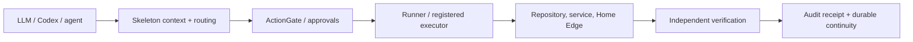

# Skeleton

[](LICENSE)
[](pyproject.toml)
[](#current-status)

Skeleton is a model-neutral control plane for safe, auditable AI-assisted engineering and edge execution.

It is designed for the point where an LLM or coding agent stops being "just chat" and starts touching repositories, CI, services, private state, or real devices. Skeleton makes that boundary explicit: declared context, registered capabilities, approval gates, bounded executors, rollback, audit evidence, and independent post-condition verification.



## What works today

Skeleton is under active development, but it is already used by its primary maintainer for real engineering work across multiple connected public repositories and a live Home Edge environment.

Current implemented areas include:

- manifest-driven project boot and cross-repository routing;
- model/provider-neutral agent and capability registries;
- approval-oriented ActionGate and bounded execution paths;
- Runner and runtime-maintenance infrastructure;
- audit-ledger and post-condition verification contracts;
- durable memory/privacy routing and recovery metadata;
- Home Edge patterns for services and physical-device control;
- generic Android/Home Edge control contracts;
- cross-repository separation of the media subsystem into [alanua/skeleton-media](https://github.com/alanua/skeleton-media).

This is not presented as broad external adoption. It is an actively maintained OSS control layer being exercised against real maintainer workflows, real runtime changes, and real recovery constraints.

See [Project impact and real-world use](docs/PROJECT_IMPACT.md) for concrete evidence and [Threat model](docs/THREAT_MODEL.md) for the security boundary.

## Five-minute public tour

This validates the public control-plane contracts without credentials, private topology, network access, or device access.

```bash
git clone https://github.com/alanua/Skeleton.git
cd Skeleton

python3 -m venv .venv
. .venv/bin/activate
python -m pip install pytest PyYAML jsonschema

PYTHONPATH=. pytest -q \
  tests/test_action_gate.py \
  tests/test_audit_ledger.py \
  tests/test_project_tree.py \
  tests/test_runner_gate.py
```

Then inspect the core declarations:

- `BOOT_MANIFEST.yaml` — canonical context entrypoint;
- `PROJECT_INDEX.yaml` / `PROJECT_TREE.yaml` — project and cross-repo routing;
- `CAPABILITY_REGISTRY.yaml` — declared capabilities;
- `EXECUTOR_REGISTRY.yaml` — registered execution paths;
- `OPERATOR_RULES.yaml` — approval and mutation rules;
- `docs/ACTION_GATE.md` — action-gating model;
- `docs/AUDIT_LEDGER.md` — audit evidence model;
- `docs/THREAT_MODEL.md` — trust boundaries and abuse cases.

## Why Skeleton exists

LLM-assisted systems become difficult to trust when context, permissions, execution, memory, and recovery live only in chat. Skeleton makes those concerns explicit and inspectable.

Core principles:

1. **Declared context** — boot from canonical manifests instead of reconstructing state from conversation history.
2. **Model neutrality** — keep ChatGPT, Codex, Gemini, local models, runners, and other agents behind explicit role contracts.
3. **Read before write** — durable mutations require current state and the correct control path.
4. **Bounded execution** — actions flow through registered executors and approval/risk gates rather than ad-hoc shell access.
5. **Auditable outcomes** — distinguish sent, accepted, applied, and independently verified state.
6. **Durable continuity** — route semantic memory, registries, live state, and audit evidence to the right stores.
7. **Recoverability** — preserve rollback, failure history, and the next safe action.

## What is in this repository

Skeleton Core currently includes:

- manifest-driven boot and project routing;
- capability, provider, executor, helper, and command registries;
- ActionGate / approval-oriented execution patterns;
- memory-routing and audit-ledger contracts;
- Runner and runtime-maintenance infrastructure;
- Home Edge / physical-device control patterns;
- generic Android/Home Edge control contracts, while media-domain implementation lives in `alanua/skeleton-media`;
- public-safe Aufmass/CAD pipeline specifications and adapters;
- CI/runtime workflows for bounded validation and recovery.

The repository is intentionally broader than a single application: it is the control plane used to build and maintain several real systems without collapsing all authority into one autonomous agent.

## Repository identity

```text
alanua/Skeleton        = Skeleton Core repository
alanua/skeleton-media  = separate public media subsystem for Home Edge
alanua/jeeves          = separate runtime/product repository and historical migration source
```

Historical prototypes may be referenced as evidence, but are not canonical runtime authority.

## Current status

```text
Status: ACTIVE_CONTROLLED_BOOTSTRAP
Active route: BOOT_MANIFEST.yaml
Current entrypoint: BOOT_MANIFEST.yaml
```

The project is under active development. Interfaces and registries may evolve while safety, auditability, and continuity rules are kept explicit.

## Maintainer workflow

Skeleton is maintained through issue triage, scoped branches/PRs, review, CI/runtime validation, exact-head verification, and bounded deployment/activation steps. AI tools may assist with research, implementation, tests, and review, but merges and security-sensitive actions remain maintainer-controlled.

See:

- [CONTRIBUTING.md](CONTRIBUTING.md)
- [SECURITY.md](SECURITY.md)
- [MAINTAINERS.md](MAINTAINERS.md)
- [docs/AI_ASSISTED_MAINTENANCE.md](docs/AI_ASSISTED_MAINTENANCE.md)
- [docs/PROJECT_IMPACT.md](docs/PROJECT_IMPACT.md)
- [docs/THREAT_MODEL.md](docs/THREAT_MODEL.md)

## Security model

Skeleton deliberately separates normal code changes from actions that can affect credentials, infrastructure, physical devices, networks, firmware, or user data. Such operations require the registered control path and the appropriate approval boundary.

Do not publish secrets, private device topology, credentials, tokens, private keys, or sensitive runtime state in issues or pull requests. See [SECURITY.md](SECURITY.md) and [docs/THREAT_MODEL.md](docs/THREAT_MODEL.md).

## Core rule

```text
Manifest controls behavior.
Markdown explains behavior.
Tooling verifies behavior.
Tests preserve behavior.
```

## Public-safe Aufmass docs

```text
docs/AUFMASS_PRIVATE_WORKSPACE_CONTRACT.md
docs/AUFMASS_PRIVATE_PILOT_PROTOCOL.md
docs/AUFMASS_SOURCE_PACK.md
```

These documents define the public/private boundary for bounded private pilots and source-pack intake.

## License

Licensed under the [Apache License 2.0](LICENSE).
