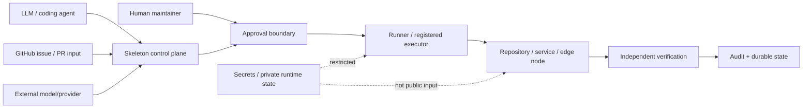

# Threat model

Skeleton sits between probabilistic AI systems and deterministic systems that can mutate repositories, services, infrastructure and physical/edge state. In the maintainer deployment, those execution chains can reach real Home Edge services and devices, so a security failure can cross the repository boundary into application or physical-world state.

That is the central reason for this threat model: AI-generated code or instructions are never treated as authority on their own, and higher-impact actions require explicit execution, approval, rollback and verification boundaries.

This document describes the public threat model for that boundary.

## Security objective

An LLM, coding agent, issue body, provider response or generated patch must never become authority merely because it produced plausible text or code.

Authority comes from explicit project state, registered capabilities, approval policy, executor identity and independently verified outcomes.

## Trust boundaries

### Untrusted or partially trusted inputs

- LLM and coding-agent output;
- issue and pull-request content;
- repository changes from unreviewed branches;
- external model/provider responses;
- network responses and runtime observations that can be stale or incomplete;
- generated commands and scripts;
- cross-repository dependency updates.

### Trusted only through explicit contracts

- approved source revision;
- declared capability;
- registered executor;
- execution lane / risk class;
- operator approval reference;
- exact target identity;
- post-condition verification;
- audit receipt and persisted state transition.

## Assets

High-value assets include:

- source repositories and protected branches;
- maintainer credentials and API tokens;
- private memory and project state;
- device registry and topology;
- CI/runtime credentials;
- Home Edge execution authority;
- Android/runtime signing material;
- network and firmware control paths;
- audit history and rollback evidence.

## Primary threats

### 1. Prompt or task injection into execution authority

A malicious issue, document, model response or generated patch attempts to cause an action outside the intended task.

Mitigations:

- capability and command registries;
- task-specific allowlists;
- explicit execution modes;
- bounded arguments/scripts;
- approval gates for sensitive operations;
- fail-closed parsing of maintenance task inputs.

### 2. Confused-deputy execution

A valid executor is tricked into acting on the wrong repository, device, identity or environment.

Mitigations:

- stable device/project identifiers;
- exact repository and revision checks;
- explicit node/target binding;
- no identity resolution by IP alone for devices;
- registered operation metadata and preconditions.

### 3. Approval bypass

Generated code or a workflow attempts to transform a low-risk operation into a privileged mutation without new human approval.

Mitigations:

- execution lanes and explicit risk classes;
- protected merge/runtime transitions;
- separate operator approval references;
- no implicit inheritance of approval across unrelated operations.

### 4. Secret or private-state disclosure

Public issues, logs, prompts or repository files accidentally expose credentials, private keys, personal data or private topology.

Mitigations:

- public/private storage separation;
- secret values kept outside public canon;
- public-safe receipts and redaction;
- SECURITY.md disclosure rules;
- fail-closed handling where a public representation cannot be made safely.

### 5. Supply-chain or cross-repository substitution

A companion repository or dependency is replaced, silently falls back to stale local code, or is loaded from an unexpected revision.

Mitigations:

- exact revision pinning where required;
- explicit repository boundaries;
- cross-repository contract tests;
- fail-closed behavior instead of silent compatibility fallback for protected paths.

The Skeleton Media separation is a concrete public example of this control.

### 6. Stale-state mutation

An agent changes a system based on chat history, an old issue, a stale branch or an outdated runtime assumption.

Mitigations:

- declared boot/context manifests;
- read-before-write rules;
- current-state prechecks;
- exact-head validation;
- durable continuity outside chat.

### 7. False success

A command exits successfully but the requested application or physical state did not actually occur.

Mitigations:

- distinguish sent / accepted / applied / physically verified;
- independent post-condition checks;
- service/API/device-state verification;
- do not treat HTTP success or exit code alone as proof.

### 8. Unsafe retry or recovery

An automated retry repeats a destructive action, compounds a partial failure, or loses rollback state.

Mitigations:

- idempotency keys;
- failure history;
- bounded retry policies;
- explicit rollback metadata;
- backup-before-mutation for sensitive changes;
- next-safe-action persistence.

### 9. Audit tampering or unverifiable history

A mutation occurs but the evidence is incomplete, misleading or stored only in chat.

Mitigations:

- structured audit receipts;
- durable state/history stores;
- exact source revision in maintenance evidence;
- independent verification before declaring success.

## Codex Security evaluation surface

Areas where automated security analysis is especially valuable include:

- executor and gateway boundaries;
- approval-gate bypasses;
- GitHub Actions and privileged maintenance workflows;
- child-process environment sanitization;
- cross-repository trust and revision pinning;
- Android/Home Edge API boundaries;
- unsafe fallbacks;
- secret exposure;
- rollback and recovery paths;
- discrepancies between accepted/applied/verified state.

Findings should become public fixes and regression tests when they can be disclosed safely.

## Out of scope for public testing

Do not probe or attack private infrastructure, household networks, physical devices, credentials or third-party systems.

Security research against Skeleton should use public code, local fixtures and systems the researcher owns or is authorized to assess.

See [SECURITY.md](../SECURITY.md) for responsible disclosure.
